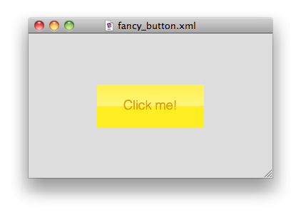
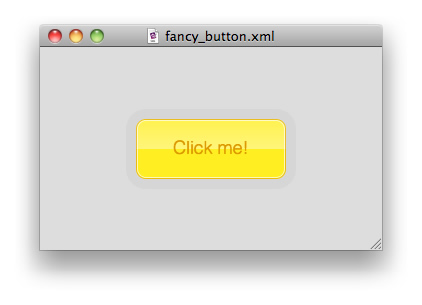
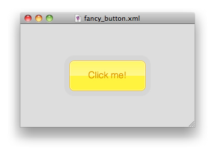

Table of Contents
-----------------
- [Introduction](#introduction)
- [Set up](#setup)
- [Hello world](#hello-world)
- [The basics](#the-basics)
- [A fancy button](#a-fancy-button)

Introduction
-------------------------------------
HSS is the design language that powers the presentational side of a document
written for the AXR platform. Its syntax is inspired in CSS, but it takes the
concept to a whole new level, providing many new features that enable newfound
flexibility and power.

It was invented by Miro Keller in 2009 and has been evolving since then. The
idea started as a small superset of CSS, but it became clear to the author that
a fresh start would be required because the burden of legacy compatibility was
too high to create a really great language. Thus, the AXR Project was started.

Set-up of the environment
--------------------------------------------
At the time of writing this tutorial, the prototype rendering engine is capable
of handling all the concepts we are going to explore, but it is not available as
a browser plug-in, yet. Thus, you need to download the test browser app for your
specific platform from the [project page](http://axr.vg/), and open XML and HSS
files located on your local computer.

To do so, point your favorite browser to the [AXR Project's website](http://axr.vg/)
and click on the big download button over there. This should download the
appropriate version of the AXR Browser for your operating system. If that
for whatever reason doesn't work, you can go directly to the 
downloads page](http://axr.vg/downloads/) and get it from there.

Once you've downloaded it, extract the files, in the case of Windows or Linux,
or mount the DMG and drag to the Applications folder, in case of Mac OSX. Then,
open the AXR Browser application.

Next, you should create a folder somewhere you can remember, and create the text
files that we are going to discuss in these tutorials. The best way is to
manually type the things in yourself, instead of copying and pasting, because
that way you'll learn much more and you'll be much less prone to overlooking
details of the syntax.

For the sake of simplicity, I'll just use paths that start with a slash as if
the files were located in the root of your hard-drive. Please prepend them with
what's missing. Say, for example that I put my files in a new folder on the
desktop, called tutorials. Whenever I see `/index.xml` in the tutorial, the
actual path to that file would be `/Users/Axerr/Desktop/tutorials/index.xml`,
since I am on a Unix-like system.

Configure your text editor to use the UTF-8 encoding, either at the time of the
file creation or in a setting in your application's settings. This encoding is
the official recommended one to use.

Hello world
------------------------------------
The first thing we'll do, to follow the tradition of all programming languages,
is creating the most basic document possible, which gives a basic output.

### Let's rock!
Open your favorite text editor, and create a new file `/hello_world.xml`. Inside
it, write this:

	<?xml version="1.0" encoding="UTF-8" ?>
	<hello>Hello world</hello>

Done! Now, open it in the prototype, and you'll see something like this:

Let's go over each line:

	<?xml version="1.0" encoding="UTF-8" ?>

This is an XML instruction that needs to be present in all XML files, as per the
[specification](http://spec.axr.vg/). We declare the file to use the 1.0 version
of the XML standard, and that our file is encoded in the UTF-8 encoding, which
is what you should always use.

	<hello>Hello world</hello>

The only requirement for the XML file that the AXR platform imposes is that the
XML document is
[well-formed](http://en.wikipedia.org/wiki/XML#Well-formedness_and_error-handling),
and that means, among other things, that there must be one, and only one, root
element that contains all the other elements. In this case our root element is
called `hello`, and it contains just some content text, `Hello world`.

### Style sheets
Now, let's style it up a bit. For that, we need to add a line to the XML file
that will determine how to find the stylesheet that will contain the
instructions on how to represent the content of the XML file:

	<?xml version="1.0" encoding="UTF-8"?>
	<?xml-stylesheet href="style.hss" type="application/x-hss" version="0.4.8" ?>
	<hello>Hello world</hello>

Here's what we added:

	<?xml-stylesheet href="style.hss" type="application/x-hss" version="0.4.8"?>

This line is a so called XML instruction, and the instruction name is
`xml-stylesheet`. Its arguments, `href`, `type` and `version` can come in any
order.

- `href` is the location of the HSS file relatively to the XML file. No absolute
  paths or URLs are supported yet in the prototype.

- `type` is the MIME type of the stylesheet. In this case, we are using
  `application/x-hss`, because it is not an official standard yet, and MIME
  rules state that you have to use the `x-` prefix for non-standard types. In
  the future, this may end up being `application/hss` or even `text/hss`

- Last, but not least, it is always required that you declare the `version` of
the AXR platform that you are targeting. In case that the syntax changes in the
future, backwards compatibility modules will be able to render old documents
correctly, becaue they will know what you meant in the first place.

Now, with your favorite text editor, create a new file `/style.hss`, and type
this:

	hello
	{
		background: #ED;
		textAlign: center;
		contentAlignY: middle;
	}

Go back to the prototype, hit refresh (cmd+R on the Mac, ctrl+R or F5 on Windows
and Linux), and you should get something like this:

Let's go over each part:

	hello
	{
	
	}

This is what's called a rule. It begins with a selector, which points to an
element in the XML source tree, which will receive whatever is defined inside of
the block (which starts with `{` and ends with `}`).

	background: #ED;

This is a property definition. First comes the property name, then immediately
after it comes a colon, then optional whitespace, then one or more values, then
more optional whitespace, and finally an end of statement (aka semicolon), which
is optional when the property definition is the last thing in the rule.

In this particular line, we are setting the `background` property of the
`hello` element to a light gray (in case, you haven't guessed it, `#ED`
represents a color).

	textAlign: center;

Here we are setting the content text to be center aligned, as you'd do in any
text processor.

	contentAlignY: middle;

And finally, here comes a small taste of the magic of HSS. How many times have
you wanted to do this with CSS? You set the content of the `hello` element to
be vertically aligned to the middle, which is equivalent to `50%`. We'll get to
it later in more detail, but for now, know that the root element will always be
as wide and tall as the window.

### Final touch
To wrap up this segment, let's change the font of the text. We are going to use
what's called an object definition, which will be explained more in depth in
further chapters. For now, just copy along. Add the following lines to the
block:

	font: @{
		face: "Impact";
		size: 40;
		color: #C;
	};

The entire file `/style.hss` now looks like this:

	hello
	{
		background: #ED;
		textAlign: center;
		contentAlignY: middle;
		font: @{
			face: "Impact";
			size: 40;
			color: #C;
		};
	}

If you reload in the prototype, you should get something like this:

You can recognize a HSS object by the `@`, which is called the object sign. Its
block contains property definitions, like normal rules do. In this concrete
example, the properties `face`, `size` and `color` are the ones we use because
we are defining a `@font` object, which is the default object type for the
`font` property.

If you didn't fully understand what's going on, don't worry. It will become much
clearer as we dive into the full syntax of objects and how to use them.

The basics
----------------------------------

### Selectors
Selectors point to the elements in your XML file, to tell the rendering engine
which properties to apply to which object. Create a new text file `/basics.xml`
and type the following:

	<?xml version="1.0" encoding="UTF-8"?>
	<?xml-stylesheet href="basics.hss" type="application/x-hss" version="1.0"?>
	<example>
		<sibling>Element A</sibling>
		<sibling>Element B</sibling>
	</example>

This basic XML file contains a root element called `example`, which contains two
children elements, called `sibling`, which in turn contain `"Element A"` and
`"Element B"` as content text

Create the HSS file: `/basics.hss`, containing the following:

	*
	{
		background: #D;
	}

If you went trough the last tutorial you can probably guess that this is a rule,
and that what's inside the block applies a gray background. The difference is
that instead of targeting the root element with its name, we are using the
universal selector, the star `*`. Open the `/basics.xml` file with the prototype
and you should see something like the following:

### Scope and nesting
If you are familiar with CSS, you may think that this applies to all elements in
the XML source. There is a crucial difference in HSS, and that is the notion of
scope. In the example, only the root element will be selected, because we always
start at root scope. To select elements further down the document tree, you need
to use nesting or combinators (these will be explored later). The scope
restricts what will be selected, and which elements are said to be in scope
depends on where in your HSS file you use a given selector.

In HSS you can put rules inside other rules, this is what's called nesting.
Change your `/basics.hss` file to look like this:

	*
	{
		background: #D;

		sibling
		{
			width: 100;
			height: 100;
			alignX: center;
			alignY: middle;
			contentAlignY: middle;
			textAlign: center;
			background: #0003;
			border: @{
				size: 1;
				color: #7;
			};
		}
	}

Reload the file and you should see something like this:

Here's what we added:

	sibling
	{
		width: 100;
		height: 100;
		alignX: center;
		alignY: middle;
		contentAlignY: middle;
		textAlign: center;
		background: #0003;
		border: @{
			size: 1;
			color: #7;
		};
	}

We are selecting all the `sibling` elements inside the previously selected
element, and adding some properties to be able to see them better. Only the two
children of the `example` element are in scope, because we are inside the rule
that selects the `example` element.

### Dissection
Let's go over the property definitions and see what they do:

	width: 100;
	height: 100;

Here we are setting the basic dimensions of the elements to 100 points. These
are resolution independent units of measure, which when the scale factor is 1
are equal to 1 screen pixel. The `width` and `height` properties accept
numbers, percentage numbers or the keyword `content` (plus some advanced things
we won't consider right now). Anywhere numbers are accepted you can also write
expressions, using common mathematical operands, such as `+`, `-`, `*` and `/`.
Parentheses are also allowed, and they are very useful to group expressions.

The default value for `width` is the percentage number `100%` and for `height`
it is the keyword `content`, therefore making them as wide as the parent and as
tall as their content when left to their default values.

Let's experiment a bit: Change the width to 50%. Now your document should look
like this:

Now we want to make them as tall as the window, so we set the height to 100%.

Maybe not completely as tall as the window. Make it 100% - 30. If you resize the
window you'll see that the empty space at the top and bottom will always be 15
points each.

Just to brag, now, we're going to take it a bit to extreme! Make the width
`(100% - (10% + 5))/2`:

OK, this is probably overdoing it :) But this is just to show that you can use
more complicated expressions without problems.

Let's go back to `width: 100; height: 100;` and then look at the next lines:

	alignX: center;
	alignY: middle;

Here we are setting the alignment point in the horizontal axis to the keyword
`center` and in the vertical axis to `middle`, both of which will be automatically
converted to `50%`.

If we change the `alignY` to `top` or `0`, you'll see it sticks to the top:

If we set it to `bottom` or `100%`, it will go to the bottom:

Intermediate values are possible, as well, of course. Apart from the keywords,
you can use percentages and plain numbers. Percentages refer to the inner
dimensions of the containing object, which means the size minus the paddings.

Experiment with the dimensions and alignment and then go back to the original
values. Then, let's have a look at the next lines:

	contentAlignY: middle;
	textAlign: center;

This is to center the content text inside each of the elements. The text object
is placed at the vertical center by means of layout, and the actual words are
just centered like in a text editor.

	background: #0003;

In this case, we are defining the background color of the element, by using the
`background` property and assigning it a hexadecimal color value. You'll
probably know this kind of notation from programs such as Photoshop or similar.

You may be wondering, why does `#0003` give a gray color? For that, let's study
all the different options we have when defining a color with hexadecimal notation.
After the "hash sign" comes values for the different channels that compose a color:

- 1 digit: Grayscale, with 16 possible values of lightness.
- 2 digits: Grayscale too, but with two digit precision, allowing 256 values.
- 3 digits: RGB, with one digit per channel.
- 4 digits: RGBA, like the last one, but with an Alpha channel too. Therefore, the
fourth digit is transparency.
- 5 digits: RGBAA, one digit per channel for the color, two digits for the alpha.
- 6 digits: RRGGBB, two digits per channel, opaque.
- 7 digits: RRGGBBA, to digits per channel with one digit alpha.
- 8 digits: RRGGBBAA, the full blown one, with two digits per channel for the color
and the transparency too.

Therefore, we can conclude that what we are seeing is actually not gray, but black
(`#000`), with the value `3` for transparency.

Finally, the border:

	border: @{
		size: 1;
		color: #7;
	};

See the `@` there? It indicates that what we are using is an HSS object. In this
case, we have omitted the object type, because we are using the default type for
the border property, which is `@lineBorder` (FIXME). Therefore, the following
would be absolutely equivalent:

	border: @lineBorder {
		size: 1;
		color: #7;
	};

But since it's quite redundant, and the default type fits our needs, we just skip
it. Inside of the block, we are defining the border to be 1 unit wide and of dark
gray color.

Experiment a bit with the properties we have learned in this section until you are
satisfied, and then let's move on to build something prettier :)

A fancy button
------------------------------------------

Ok let's do something a bit more advanced. We're going to create a button, with
some different states.

Let's start with some basic XML. Create a new file called `/fancy_button.xml` and
then write this:

	<?xml version="1.0" encoding="UTF-8" ?>
	<?xml-stylesheet href="fancy_button.hss" type="application/x-hss" version="0.4.8" ?>
	<document>
		<link>Click me!</link>
	</document>

Create the HSS file: `/fancy_button.hss`, containing the following as a starting
point:

	*
	{
		background: #D;
	}

As a reminder, we are targeting the root element with the universal selector `*`,
and since at the base level only this one is in scope, it will be the only element
selected. You'll see the document with a gray background:

### Basic styling

Now, let's give the button some basic dimensions and some rudimentary styles:

    *
    {
        background: #D;

        link
        {
            width: 150;
            height: 60;
            alignX: center;
            alignY: middle;
            contentAlignY: middle;
            textAlign: center;
            background: #FE2;
            font: @font {
                face: "Helvetica";
                color: #D90;
            };
        }
    }

You'll see something like this:

Let's go over the property definitions and see what they do. Here we are setting the
basic dimensions of the element, and aligning it in the center of the page:

	width: 150;
	height: 60;
	alignX: center;
	alignY: middle;

We align the content text in the vertical center of the button, and set the text to
be center-aligned, like in a text processor:

	contentAlignY: middle;
	textAlign: center;

We set the background to be a yellow color:

	background: #FE2;

Finally, we change the font, to be a bit cleaner, and use a color that fits better
in the color scheme.

	font: @font {
		face: "Helvetica";
		color: #D90;
	};

### Modularize!

We started applying the styles directly to the element, but to make the style more
reusable, this is a good moment to split out the code and modularize it.

To better understand this, let's first discuss how objects work in HSS. Everything
in HSS is an object: every element, every color... every value is an object, even
though many times you will be using literal values, like a string or a number,
directly. For more complex values, you use what's called an "object definition",
like when defining a font or a shape.

All objects have a type, an "object type" to be precise. This is what comes after
the `@` when writing an object definition, although it can be skipped in some
circumstances. They can also optionally have a name, but keep in mind that up
until now we have always used them in their anonymous form.

Therefore, when you write an object definition, you are providing a template with
which a new object can be created, which happens when you pass it by name to a
property, or you inherit from it by using the `isA` property.

Let's begin with a simple example, which we have actually already used in our
code. Here we are passing an anonymous `@font` object to the `font` property of
the `foo` element. We could put the object definition outside of the rules (e.g.
at the very beginning of the file), and then pass it using its name:

    foo
    {
        font: @font {
        	face: "Helvetica";
        	color: #D90;
        };
    }

Notice how after the object sign and type (`@font`), there is the object name
(`myFont`), which is then written as the value for the `font` property:

    @font myFont
	{
    	face: "Helvetica";
    	color: #D90;
    }
    
    element
    {
        font: myFont;
    }

Now, if you want to make one object inherit from another, you can use the `isA`
property, which exists on all objects:

    @font myFont
	{
    	face: "Helvetica";
    	color: #D90;
    }

	@font myFont2
	{
		isA: myFont;
		size: 20;
	}

This way, `myFont2` will have all the properties of `myFont`, and additionally
`size: 20`. You can also overwrite the ones you've previously inherited.

### Elements are objects, too

Now that we've come up to this point, you need to know that for each node in the
XML tree that has been read, an HSS object of type `@container` will be created.
This means that the same rules apply for them as for any other object, like the
inheritance we just discussed.

So, back to our fancy button. We take most of the properties out of the rule and
put them in an object definition, which we apply with `isA`, like so:

    @container fancyButton
    {
        contentAlignY: middle;
        background: #FE2;
        textAlign: center;
        font: @font {
            face: "Helvetica";
            color: #D90;
        };
    }

    *
    {
        background: #D;

        link
        {
            isA: fancyButton;
            width: 150;
            height: 60;
            alignX: center;
            alignY: middle;
        }
    }

If you reload the document you will see... no change at all! But what we achieved
with this is that if we were to apply the style to another element, we wouldn't
need to copy paste or group selectors together, but we would just apply it by
its name. We just made it modular.

### Modularizing colors

As we discussed earlier, everything is an object. When we write a number sign
followed by a hexadecimal number, we are expressing what is called a "color
instruction". When the HSS parser encounters one of these, it actually creates an
`@rgb` object on the fly and returns that one instead.

The syntax of the color instructions allow for using a name too, which will be the
object name of that generated color object. You just write the value followed by a
space and the desired name, like so:

	#D mainBgColor;

This is equivalent to:

	@rgb mainBgColor
	{
		red: 221;
		green: 221;
		blue: 221;
		alpha: 100%;
	}

So what we are going to do now is to take out all the colors that have been used
directly, and define them at the top of the file:

    #D mainBgColor;
    #FE2 buttonColorBase;
    #D90 buttonFontColor;
    
    @container fancyButton
    {
        contentAlignY: middle;
        background: buttonColorBase;
        textAlign: center;
        font: @font {
            face: "Helvetica";
            color: buttonFontColor;
        };
    }

    *
    {
        background: mainBgColor;

        link
        {
            isA: fancyButton;
            width: 150;
            height: 60;
            alignX: center;
            alignY: middle;
        }
    }

Again, if we reload the file nothing has changed, but we are doing this to be as
reusable as possible. Eventually an entire framework arises out of various
components that are defined and used throughout the entire site.

### Glossin' it up

Let's add a dash of "web2.0" to the button style: let's make the button glossy!
For this we are going to take advantage of the ability to overlay multiple
objects as background for our container, so we are going to define a linear
gradient that goes from top to bottom, that does a hard step to more transparent
in the middle, giving it the impression that it is reflective:

    @linearGradient gloss
    {
        startColor: #FFF3;
        colorStops: #FFF6, transparent;
        endColor: transparent;
        endY: 100%;
    }

Let's dissect this: The gradient object has by default `startX`, `startY`,
`endX` and `endY` all `0`. Therefore if we want to make it go from top to
bottom we leave everything as it is except the `endY` property, which will be
placed all the way to the bottom, therefore `100%`.

We start at `#FFF3`, which is a quite transparent white. Then we add two color
stops, which, since we want them both at exactly the center, we just use colors
directly. We could have also used `@colorStop { color: #FFF6; position: 50% }`,
but that's way more verbose, and the default position suits us just fine. Since
both color stops are placed at the same spot, it will jump from the
semitransparent white to the fully transparent color immediately. Notice also
how the `transparent` keyword correctly creates a color that is that is the
same as the surrounding one(s) (`#FFF`) and with alpha `0`, not just black
transparent, which would look very ugly in this case.

Finally, we just continue fully transparent until the bottom.

Now we just need to apply the gradient on top of the background color:

	background: buttonColorBase, gloss;

We get something that looks like this:

The full code is now:

    #D mainBgColor;
    #FE2 buttonColorBase;
    #D90 buttonFontColor;
    
    @linearGradient gloss
    {
        startColor: #FFF3;
        colorStops: #FFF6, transparent;
        endColor: transparent;
        endY: 100%;
    }
    
    @container fancyButton
    {
        contentAlignY: middle;
        background: buttonColorBase, gloss;
        textAlign: center;
        font: @font {
            face: "Helvetica";
            color: buttonFontColor;
        };
    }

    *
    {
        background: mainBgColor;

        link
        {
            isA: fancyButton;
            width: 150;
            height: 60;
            alignX: center;
            alignY: middle;
        }
    }

### More bells and whistles

Alright, let's round it off: we're going to round those pointy corners
and add borders to give it some volume.

Add the following to the `fancyButton` object definition:

	shape: @roundedRect { corners: 10 };

This will make the object use a shape that draws round corners, using
the given size as the radius.

Since this is pretty verbose, we're going to use advantage of the default
object type and shorthand notation to cut it down. The following is equivalent:

	shape: @{ 10 };

It will look like this:

Now this still looks quite flat, let's add some borders to create a bevel
effect. First we define the colors:

	#FFFA buttonHighlightColor;
	#D909 buttonShadowColor;

Then, we define the borders, directly on the `fancyButton` object definition:

	border: @lineBorder {
		size: 1;
		color: buttonHighlightColor;
		position: inside;
	}, @lineBorder {
		size: 1;
		color: buttonShadowColor;
		position: inside;
	};

This adds to thin borders to the inside of the shape. It will now look
something like this:

To add even more, let's make something that looks sort of like a drop
shadow. Add one more border after the other two, this time to the outside
of the shape:

	@lineBorder {
		size: 10;
		color: #00008;
		position: outside;
	}

The entire code now looks like this:

	#D mainBgColor;
	#FE2 buttonColorBase;
	#D90 buttonFontColor;
	#FFFA buttonHighlightColor;
	#D909 buttonShadowColor;

	@linearGradient gloss
	{
		startColor: #FFF3;
		colorStops: #FFF6, transparent;
		endColor: transparent;
		endY: 100%;
	}

	@container fancyButton
	{
		contentAlignY: middle;
		background: buttonColorBase, gloss;
		textAlign: center;
		font: @
		{
			face: "Helvetica";
			color: buttonFontColor;
			weight: normal; //FIXME
		};
		shape: @{ 10 };
		
		border: @lineBorder {
			size: 1;
			color: buttonHighlightColor;
			position: inside;
		
		}, @lineBorder {
			size: 1;
			color: buttonShadowColor;
			position: inside;

		}, @lineBorder {
			size: 10;
			color: #00008;
			position: outside;
		};
	}

	*
	{
		background: mainBgColor;

		link
		{
			isA: fancyButton;
			width: 150;
			height: 60;
			alignX: center;
			alignY: middle;
		}
	}

The result:

### Hover state

Each element stores so called "flags", that determine what state they're in. Think of them sort of like classes in CSS. They can be turned on and off at will, or automatically by the rendering engine, as you will see in a minute. For how to control flags defined by the author, refer to a more advanced tutorial.

Alright, now we're going to add some interactivity to the button, by changing
the background color when the mouse is placed over it. First, we define the color:

	#FFF340 buttonColorHover;

Then, we target the link element only when the hover flag is active. Add the
following after the rule that targets `link`:

	link::hover
	{
		background: buttonColorHover, gloss;
	}

Now when you place your mouse cursor over the button, it will look like this:

You may not be able to see the difference right here on the screenshot, but it
is immediately visible when seeing it live.

The important part of the syntax to note is the double colons `::`, followed by the flag name as an identifier `hover`. This is a system-provided flag, so it will be automatically turned on and off as you pass the mouse pointer over the elements.

#### Modularizing flags

Now, this is not the most optimal way to do it, in this situation, since we are defining the flag outside of the object definition. We want this hover state to be applied to all elements where we have applied the `fancyButton` object definition, so we are going to use rules inside object definitions.

Basically, it's the same concept as with nested rules, you put the rules that apply to the children (or other relation) inside the definition object, and when applying it, the entire structure will be affected. Keep in mind that this only makes sense with object types can have children (with some exceptions that will be covered in a more advanced tutorial).

So inside the `fancyButton` object definition, we're going to add a rule that targets itself, using the `@this` "reference object", combined with the hover flag as before.

	@container fancyButton
	{
		contentAlignY: middle;
		background: buttonColorBase, gloss;
		...
	
		@this::hover
		{
			background: buttonColorHover, gloss;
		}
	}

To make it more convenient, the default object type in a selector is `this`, therefore you can skip the word:

	@::hover
	{
		background: buttonColorHover, gloss;
	}

If you forget the `@`, remember that it would be interpreted as `*::hover`, targeting the children instead.

The entire code now looks like this:

	#D mainBgColor;
	#FE2 buttonColorBase;
	#FFF340 buttonColorHover;
	#D90 buttonFontColor;
	#FFFA buttonHighlightColor;
	#D909 buttonShadowColor;

	@linearGradient gloss
	{
		startColor: #FFF3;
		colorStops: #FFF6, transparent;
		endColor: transparent;
		endY: 100%;
	}

	@container fancyButton
	{
		contentAlignY: middle;
		background: buttonColorBase, gloss;
		textAlign: center;
		font: @font {
			face: "Helvetica";
			color: buttonFontColor;
			weight: normal; //FIXME
		};
		shape: @roundedRect { 10 };
	
		border: @lineBorder {
			size: 1;
			color: buttonHighlightColor;
			position: inside;
		
		}, @lineBorder {
			size: 1;
			color: buttonShadowColor;
			position: inside;
		
		}, @lineBorder {
			size: 10;
			color: #00008;
			position: outside;
		};
	
		@::hover
		{
			background: buttonColorHover, gloss;
		}
	}

	*
	{
		background: mainBgColor;

		link
		{
			isA: fancyButton;
			width: 150;
			height: 60;
			alignX: center;
			alignY: middle;
		}
	}

Now, whenever the `fancyButton` is applied, you get hovers too!

### Press state

To finish off this tutorial, lets add some feedback for when the button is actually pressed with the mouse, so the user knows that the button was successfully clicked. We'll use the system-provided `press` flag.

We add yet another color:

	#FD2 buttonColorPress;
	

And we add the rule with the flag, right after the hover one:

	
	@container fancyButton
	{
		contentAlignY: middle;
		background: buttonColorBase, gloss;
		...
	
		@::hover
		{
			background: buttonColorHover, gloss;
		}

		@::press
		{
			background: buttonColorPress, gloss;
		}
	}
	
So now when the button is pressed, it looks like this:

//FIXME: insert image here

The fully completed code looks like this:

	
	#D mainBgColor;
	#FE2 buttonColorBase;
	#FFF340 buttonColorHover;
	#FD2 buttonColorPress;
	#D90 buttonFontColor;
	#FFFA buttonHighlightColor;
	#D909 buttonShadowColor;

	@linearGradient gloss
	{
		startColor: #FFF3;
		colorStops: #FFF6, transparent;
		endColor: transparent;
		endY: 100%;
	}

	@container fancyButton
	{
		contentAlignY: middle;
		background: buttonColorBase, gloss;
		textAlign: center;
		font: @font {
			face: "Helvetica";
			color: buttonFontColor;
			weight: normal; //FIXME
		};
		shape: @roundedRect { 10 };
	
		border: @lineBorder {
			size: 1;
			color: buttonHighlightColor;
			position: inside;
		
		}, @lineBorder {
			size: 1;
			color: buttonShadowColor;
			position: inside;
		
		}, @lineBorder {
			size: 10;
			color: #00008;
			position: outside;
		};
	
		@::hover
		{
			background: buttonColorHover, gloss;
		}
	
		@::press
		{
			background: buttonColorPress, gloss;
		}
	}

	*
	{
		background: mainBgColor;

		link
		{
			isA: fancyButton;
			width: 150;
			height: 60;
			alignX: center;
			alignY: middle;
		}
	}
	
